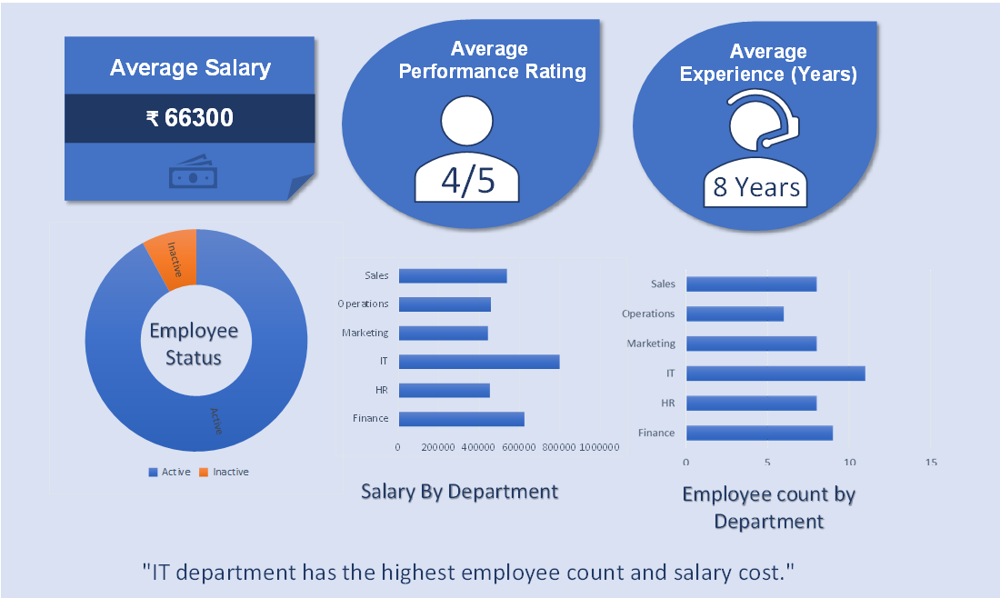

# Employee Analytics Dashboard (Excel)

## 📊 Project Overview
This project analyzes employee data using Excel and presents insights through an interactive dashboard.

## 🔑 Key KPIs
- Average Salary
- Average Performance Rating
- Average Experience (Years)

## 📈 Visualizations
- Donut Chart: Employee Status
- Bar Chart: Salary by Department
- Bar Chart: Employee Count by Department

## 💡 Key Insight
IT department has the highest employee count and salary cost.

## 🛠 Tools Used
- Microsoft Excel
- Pivot Tables
- Pivot Charts
- Dashboard Design

## 👤 Author
Prashant Kumar Rathod
